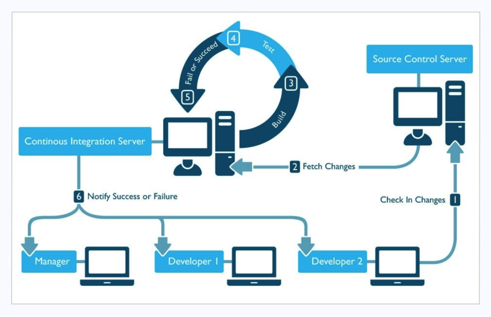

# Requirements Definition

## Requirements Definition

In contrast to the world of classic software engineering, FOSS communities do not seem to readily adopt or practice modern software engineering or requirements engineering processes. Perhaps this is no surprise. However, these communities do develop software that is extremely valuable, generally reliable, often trustworthy, and readily used within its associated user community. So, what processes are being used to develop the requirements for open software systems?

### Activities & Processes

In open software development projects, requirements engineering efforts are implied activities that routinely emerge as a by-product of community discourse about what their software should or should not do, as well as who will take responsibility for realizing such requirements. Open software system requirements appear in the form of situated discourse within private and public email discussion threads, emergent artifacts \(e.g., source code fragments included within a message\) and dialectical social actions that negotiate interest, commitment, and accountability. More simply, traditional requirements engineering activities do not have first-class status as an assigned or recognized task within open software communities. Similarly, there are no software engineering tools used to support the capture, negotiation, and cost estimate \(e.g., level of effort, expertise/skill, and timeliness\) of open software development efforts, though each of these activities occurs regularly but informally.

Open software systems may be very reliable and high quality in their users’ assessments. Nonetheless requirements do exist, though finding or recognizing them demands familiarity and immersion within the community and its discussions. This of course stands in contrast to efforts within the academic software engineering or requirements engineering community to develop and demonstrate tools for explicitly capturing requirements, negotiating trade-offs among system requirements and stakeholder interests, and constructive cost estimation or modeling.

Developing open software requirements is a community building process. In this regard, the development of requirements for open software is not a traditional requirements engineering process, at least, not yet. It is instead socio-technical process that entails the development of constructive social relationships, informally negotiated social agreements, and a commitment to participate through sustained contribution of software discourse and shared representations, much like the other processes identified above. Thus, community building and sustaining participation are essential and recurring activities that enable open software to persist without central corporate authority.

### New Types of Requirements

Open software Web sites serve as hubs that centralize attention for what is happening with the development of the focal open software system, its status, participants and contributors, discourse on pending/future needs, etc. Furthermore, by there very nature, open software Web sites \(those accessible outside of a corporate firewall\) are generally global in reach and accessibility. This means the potential exists for contributors to come from multiple remote sites \(geographic dispersion\) at different times \(24/7\), from multiple nations, potentially representing the interests of multiple cultures or ethnicity. All of these conditions point to new kinds of requirements — for example, community building requirements, community software requirements, and community information sharing system \(Web site and interlinked communication channels for email, forums, and chat\) requirements. These requirements may entail both functional and non-functional requirements, but they will most typically be expressed using open software information, rather than using formal notations based on some system of mathematical logic.

## Build Techniques

### Build Process

In the context of software development, build refers to the process that converts files and other assets under the developers' responsibility into a software product in its final or consumable form. The build process usually includes compiling source codes, generating a manifest file, producing an installer, copying and moving files around among different directories, packaging binary files, running unit tests, etc.

### Build Tools/Frameworks

There are many open-source build frameworks available, such as make, Ant, Maven, rake, etc. Most of these tools allow you to automate these repeatable build process and tasks.

#### GNU Make \[1\]

GNU Make is a tool that builds the generation of executables and other non-source files of a program from the program’s source files. Make gets information about how to build and install your program from a file called the makefile, which contains a list of the non-source files and how to compute it from other files.

* [Project Page ](https://www.gnu.org/software/make/)
* [Source Code ](https://savannah.gnu.org/git/?group=make)
* License: [GNU GPL ](https://en.wikipedia.org/wiki/GNU_General_Public_License)
* OSSpal Rating

#### Apache Ant \[2\]

Apache Ant is a Java library and command-line tool whose mission is to drive processes described in build files as targets and extension points dependent upon each other. The main known usage of Ant is the build of Java applications.

* [Project Page](http://ant.apache.org/) 
* [Source Code ](https://github.com/apache/ant)
* License: [Apache License 2.0 ](https://en.wikipedia.org/wiki/Apache_License_2.0)
* OSSpal Rating

#### Apache Maven \[3\]

Maven is another build framework for Java applications, whose primary goal is to allow a developer to comprehend the complete state of a development effort in the shortest period of time. Maven can manage a project's build, reporting, and documentation from a central piece of information.

* [Project Page ](https://maven.apache.org/)
* [Source Code ](https://maven.apache.org/scm.html)
* License: [Apache License 2.0 ](https://en.wikipedia.org/wiki/Apache_License_2.0)
* OSSpal Rating

#### Rake \[4\]

Rake is a make-like program implemented in Ruby. It is a software task management and build automation tool. It allows users to specify tasks and describe dependencies in standard Ruby syntax.

* [Project Page](https://ruby.github.io/rake/) 
* [Source Code ](https://github.com/ruby/rake)
* License: [MIT License ](https://en.wikipedia.org/wiki/MIT_License)
* OSSpal Rating

### Continuous Integration

Continuous Integration \(CI\) is the practice of merging all developer working copies to a shared mainline several times a day. Build automation is a prerequisite for continuous integration. The CI server is usually linked to the version control system \(e.g., Git, SVN\) and supports build tools/frameworks mentioned out of the box. Before checking into the code, developers should run automated unit tests on their local machine to ensure their changes won’t break the build. The build server, as part of the CI process, periodically runs automated unit and integration tests. Problems are reported to the developers through email or other integrated messenger services. The idea is to apply quality control to the product continuously and hopefully find any potential problems as quickly as possible. Many open source CI solutions are available, such as Jenkin, Travis CI, Strider, GoCD, among many others.

### Continuous Integration Software

#### Jenkins \[5\]

Jenkins is the number one open-source product for automating your project. It is developed in Java and can be installed using simple Java – jar Jenkins.war command after downloading the WAR file. Common uses include building projects, running tests, bug detection, code analysis, and project deployment. It supports an array of SCM tools – Git, Mercurial, Subversion, Clearcase, and many more.

* [Project Page ](https://jenkins.io/)
* [Source Code ](https://github.com/jenkinsci/jenkins)
* License: [MIT License](https://en.wikipedia.org/wiki/MIT_License) 
* OSSpal Rating

#### Travis CI \[6\]

Travis CI is a hosted, distributed, continuous integration service used to build and test software projects hosted at GitHub. It is open source and obviously free to host on your own service, but it also offers a SaaS version that allows free testing for open source projects.

* [Project Page ](https://travis-ci.org/)
* [Source Code ](https://github.com/travis-ci/travis-ci)
* License: [MIT License ](https://en.wikipedia.org/wiki/MIT_License)
* OSSpal Rating

#### Strider \[7\]

Strider is an open source continuous deployment/continuous integration platform. It is written in Node.JS and JavaScript, and uses MongoDB as a backing store. Strider is extremely customizable through plugins and may require you to put your hands in code. MongoDB and Node.js are prerequisites for installing Strider.

* [Project Page ](http://strider-cd.github.io/)
* [Source Code ](https://github.com/Strider-CD/strider)
* License: [New BSD License ](https://en.wikipedia.org/wiki/New_BSD_License)
* OSSpal Rating

#### Go \[8\]

Go was created and then open sourced by ThoughWorks, and is an open source tool used in software development to achieve continuous delivery \(CD\) of software. With Go, regularly performed tasks can be added as pipelines. The instances of these activities are called jobs. Another interesting addition is the ability to visualize the entire continuous delivery workflow of the value stream map. The map helps you track the entire change from commitment to deployment.

* [Project Page](https://www.gocd.org/) 
* [Source Code ](https://github.com/gocd/gocd)
* License: [Apache License 2.0 ](https://en.wikipedia.org/wiki/Apache_License_2.0)
* OSSpal Rating

### Resources

#### Video Training

* [5h video training: "Creating High Performance Organizations" ](https://leanagile.study/)
* [My 4.5h continuous delivery video training course ](http://bit.ly/jez-cd-training)
* [Interviews with Eric Ries, Elisabeth Hendrickson, John Allspaw, Jesse Robbins, and Gary Gruver](http://bit.ly/jez-cd-interviews)

#### Books

* [Lean Enterprise,book \(2015\) ](https://www.amazon.com/Lean-Enterprise-Performance-Organizations-Innovate/dp/1449368425)
* [The DevOps Handbook \(2015\) ](https://www.amazon.com/DevOps-Handbook-World-Class-Reliability-Organizations/dp/1942788002)
* [Continuous Delivery,book \(2010\)](https://www.amazon.com/Continuous-Delivery-Deployment-Automation-Addison-Wesley/dp/0321601912)

#### Articles

* [5 Traits of a Good Delivery Pipeline ](https://www.thoughtworks.com/insights/blog/5-traits-good-delivery-pipeline)
* [\[Podcast\] Build Pipelines as Code with LambdaCD ](https://www.thoughtworks.com/insights/blog/podcast-build-pipelines-code-lambdacd)
* [Infrastructure as Code: A Reason to Smile ](https://www.thoughtworks.com/insights/blog/infrastructure-code-reason-smile)
* [Comparison of continuous integration software ](https://en.wikipedia.org/wiki/Comparison_of_continuous_integration_software)
* [List of build automation software](https://en.wikipedia.org/wiki/List_of_build_automation_software#Continuous_integration)

#### Online Courses

* [Continuous Integration and Deployment ](https://www.udacity.com/course/continuous-integration-and-deployment--ud1030)
* [Continuous Integration Courses ](https://www.udemy.com/topic/continuous-integration/)
* [Continuous Integration and Continuous Deployment](https://www.edx.org/course/continuous-integration-continuous-microsoft-devops200-3x-0)

